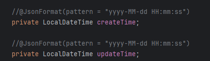

## 1.格式转换
在将后端数据以json形式传给前端时，经常需要设定数据的格式，例如时间
<br>
传统的解决方法是通过@JsonFormat注解来解决，但当时间格式都是统一的时，一个一个的加未免有点麻烦，我们可以创建一个消息转换器统一实现某类数据的格式转换
```java
    @Configuration
@Slf4j
public class WebMvcConfiguration extends WebMvcConfigurationSupport {
    /**
     * 扩展springmvc框架的消息转换器
     *
     * @param converters
     */
    @Override
    protected void extendMessageConverters(List<HttpMessageConverter<?>> converters) {
        //创建一个消息转化器对象
        MappingJackson2HttpMessageConverter Converter = new MappingJackson2HttpMessageConverter();
        //为消息转换器设置一个对象转换器，对象转换器可以将Java对象序列化为json数据
        Converter.setObjectMapper(new JacksonObjectMapper());
        //将自己的消息转换器加入容器中,0代表索引，排在第一位
        converters.add(0,Converter);

    }
}
```
其中JacksonObjectMapper是一个比较固定的东西，其代码如下
```java
import com.fasterxml.jackson.databind.DeserializationFeature;
import com.fasterxml.jackson.databind.ObjectMapper;
import com.fasterxml.jackson.databind.module.SimpleModule;
import com.fasterxml.jackson.datatype.jsr310.deser.LocalDateDeserializer;
import com.fasterxml.jackson.datatype.jsr310.deser.LocalDateTimeDeserializer;
import com.fasterxml.jackson.datatype.jsr310.deser.LocalTimeDeserializer;
import com.fasterxml.jackson.datatype.jsr310.ser.LocalDateSerializer;
import com.fasterxml.jackson.datatype.jsr310.ser.LocalDateTimeSerializer;
import com.fasterxml.jackson.datatype.jsr310.ser.LocalTimeSerializer;

import java.time.LocalDate;
import java.time.LocalDateTime;
import java.time.LocalTime;
import java.time.format.DateTimeFormatter;

import static com.fasterxml.jackson.databind.DeserializationFeature.FAIL_ON_UNKNOWN_PROPERTIES;

/**
 * 对象映射器:基于jackson将Java对象转为json，或者将json转为Java对象
 * 将JSON解析为Java对象的过程称为 [从JSON反序列化Java对象]
 * 从Java对象生成JSON的过程称为 [序列化Java对象到JSON]
 */
public class JacksonObjectMapper extends ObjectMapper {

    public static final String DEFAULT_DATE_FORMAT = "yyyy-MM-dd";
    //public static final String DEFAULT_DATE_TIME_FORMAT = "yyyy-MM-dd HH:mm:ss";
    public static final String DEFAULT_DATE_TIME_FORMAT = "yyyy-MM-dd HH:mm";
    public static final String DEFAULT_TIME_FORMAT = "HH:mm:ss";

    public JacksonObjectMapper() {
        super();
        //收到未知属性时不报异常
        this.configure(FAIL_ON_UNKNOWN_PROPERTIES, false);

        //反序列化时，属性不存在的兼容处理
        this.getDeserializationConfig().withoutFeatures(DeserializationFeature.FAIL_ON_UNKNOWN_PROPERTIES);

        SimpleModule simpleModule = new SimpleModule()
                .addDeserializer(LocalDateTime.class, new LocalDateTimeDeserializer(DateTimeFormatter.ofPattern(DEFAULT_DATE_TIME_FORMAT)))
                .addDeserializer(LocalDate.class, new LocalDateDeserializer(DateTimeFormatter.ofPattern(DEFAULT_DATE_FORMAT)))
                .addDeserializer(LocalTime.class, new LocalTimeDeserializer(DateTimeFormatter.ofPattern(DEFAULT_TIME_FORMAT)))
                .addSerializer(LocalDateTime.class, new LocalDateTimeSerializer(DateTimeFormatter.ofPattern(DEFAULT_DATE_TIME_FORMAT)))
                .addSerializer(LocalDate.class, new LocalDateSerializer(DateTimeFormatter.ofPattern(DEFAULT_DATE_FORMAT)))
                .addSerializer(LocalTime.class, new LocalTimeSerializer(DateTimeFormatter.ofPattern(DEFAULT_TIME_FORMAT)));

        //注册功能模块 例如，可以添加自定义序列化器和反序列化器
        this.registerModule(simpleModule);
    }
}
```
## 2.swagger
swagger会帮我们自动生成一个用于测试的网页（http://localhost:8080/doc.html）
<br>我们只需要在配置类中加上下面的代码就可以使用
```java
 /**
     * 通过knife4j生成接口文档
     *
     * @return
     */
    @Bean
    public Docket docket() {
        ApiInfo apiInfo = new ApiInfoBuilder()
                .title("苍穹外卖项目接口文档")
                .version("2.0")
                .description("苍穹外卖项目接口文档")
                .build();
        Docket docket = new Docket(DocumentationType.SWAGGER_2)
                .apiInfo(apiInfo)
                .select()
                .apis(RequestHandlerSelectors.basePackage("com.sky.controller"))//要扫描的借口，包含其他的可以添加
                .paths(PathSelectors.any())
                .build();
        return docket;
    }

    /**
     * 设置静态资源映射
     *
     * @param registry
     */
    @Override
    protected void addResourceHandlers(ResourceHandlerRegistry registry) {
        registry.addResourceHandler("/doc.html").addResourceLocations("classpath:/META-INF/resources/");
        registry.addResourceHandler("/webjars/**").addResourceLocations("classpath:/META-INF/resources/webjars/");
    }

```
## 3.builer
我们可以通过builder来构建一个类
```java
Employee employee = Employee.builder()
                .status(status)
                .id(id)
                .build();
```
需要在Employee类上加上@Builder注解。<br>
Builder模式的原理是通过一个Builder类来构建复杂的对象。Builder类包含了与目标对象相同的属性和方法，但是它们的返回值都是Builder类本身，这样可以通过链式调用的方式来设置目标对象的属性，最终构建出一个完整的目标对象。其实现如下，务必背一下
```java
public class Person {
    private final String name;
    private int age;
    private final String address;

    private Person(Builder builder) {
        this.name = builder.name;
        this.age = builder.age;
        this.address = builder.address;
    }

    public static class Builder {
        private String name;
        private int age;
        private String address;

        public Builder name(String name) {
            this.name = name;
            return this;
        }

        public Builder age(int age) {
            this.age = age;
            return this;
        }

        public Builder address(String address) {
            this.address = address;
            return this;
        }

        public Person build() {
            return new Person(this);
        }
    }
}
```